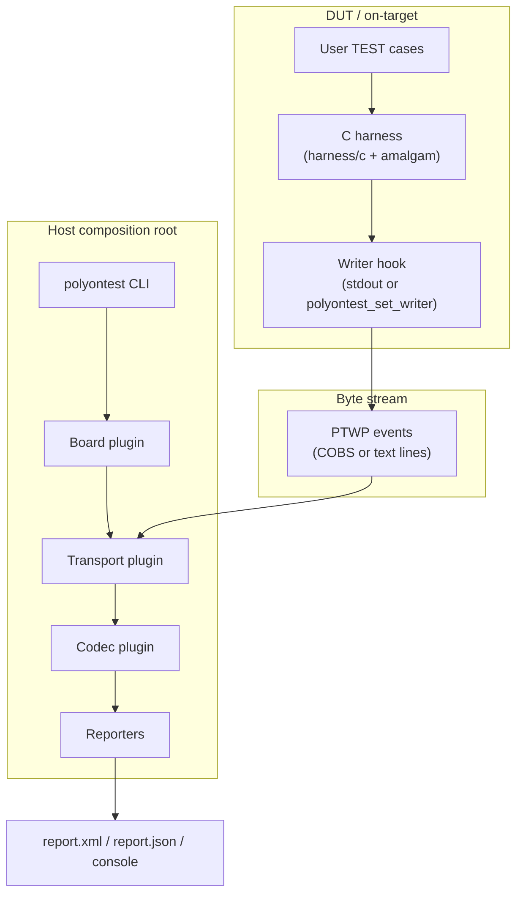
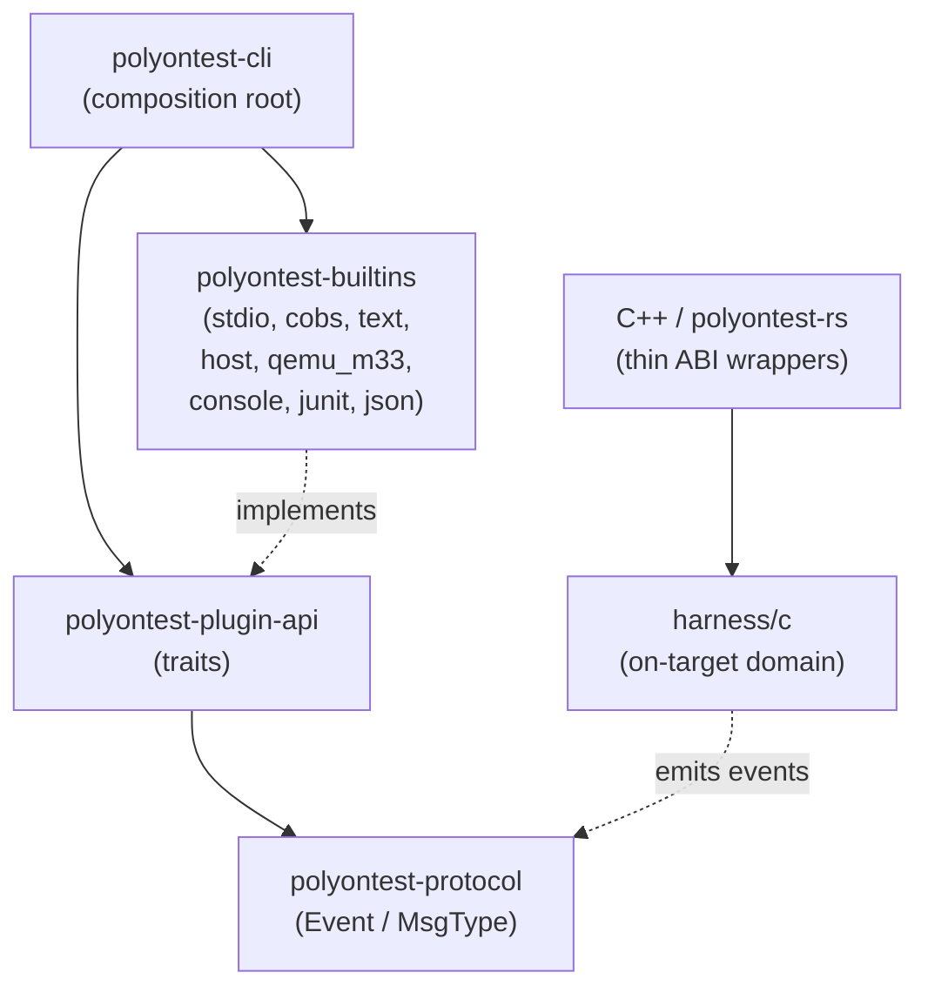
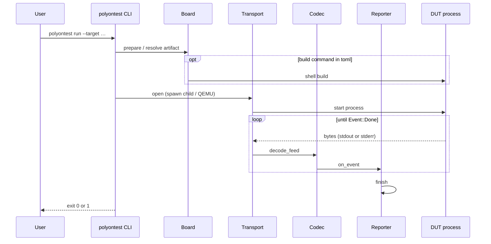
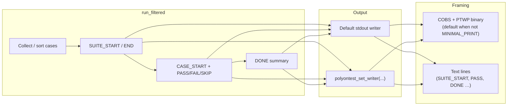

# Architecture

PolyOnTest splits an **on-target C harness** from a **Rust host CLI**. They share
one wire model: PTWP events framed as COBS binary or plain text. Outer plugins
depend inward; **core never imports** a concrete UART, USB, board, or reporter.

## System context

## Container dependencies

| Layer | Location | Role |
|-------|----------|------|
| Composition root | `crates/polyontest-cli` | Load toml, select plugins, drain until `Done` |
| Plugin traits | `crates/polyontest-plugin-api` | `Transport`, `Codec`, `Board`, `Reporter`, `ExtensionPack` |
| Builtins | `crates/polyontest-builtins` | In-tree host/QEMU/codec/reporter impls |
| Protocol | `crates/polyontest-protocol` | Codec-agnostic `Event` enum |
| On-target domain | `harness/c`, `harness/include` | Runner, asserts, registration |
| Drop-in amalgam | `dist/polyontest.h`, `dist/polyontest.c` | Generated via `scripts/amalgamate.py` |

## SOLID mapping

| Principle | Application |
|-----------|-------------|
| S | One plugin kind per concern |
| O | Add HCI/nanopb/Pico as plugins without editing Core |
| L | Any `Transport` / `Codec` is interchangeable |
| I | Separate traits — not one mega-plugin |
| D | CLI depends on traits; `polyontest.toml` selects impls |

## On-target vs host

| Side | Mechanism |
|------|-----------|
| Host | Rust traits + in-tree builtins |
| Target | Compile-time hooks (`polyontest_set_writer`, section/ctors) — no dlopen |

!!! note "QEMU `transport = \"uart\"`"
    For `qemu_m33`, the logical transport id is `uart`, but I/O is **semihosting
    written to QEMU stderr**, not a real UART peripheral. See the QEMU example
    board glue under `examples/qemu_m33_smoke/`.

## Host run sequence

## On-target emit path

## PTWP events

Structured results use COBS-framed PTWP payloads (`codec = "cobs"`). Hobbyists
can use `POLYONTEST_MINIMAL_PRINT` / `codec = "text"` instead.

| Event (protocol) | Typical meaning |
|------------------|-----------------|
| `SuiteStart` / `SuiteEnd` | Suite boundary |
| `CaseStart` / `CaseEnd` | Case boundary with status |
| `AssertFail` | Failed assertion detail |
| `Log` | Diagnostic line |
| `Done` | Terminal counts — CLI stops draining |

## Size profiles and discovery

Compile-time profiles (`POLYONTEST_PROFILE_TINY` / `SMALL` / `FULL`) map to
`POLYONTEST_CFG_HAS_*` feature macros. See [Profiles](profiles.md).

Default discovery uses `__attribute__((constructor))`. Optional
`POLYONTEST_USE_SECTION_REGISTRY` walks `.polyontest_info` / `__DATA,polyontest`.
Linker details live on the profiles page.

## Related

- [Concepts](concepts.md) — progressive enhancement and lifecycle
- [Roadmap](roadmap.md) — isolation, HIL, coverage, chaos (design)
- [Plugins](plugins.md) — authoring builtins
- [CLI](cli.md) — toml schema and filters
