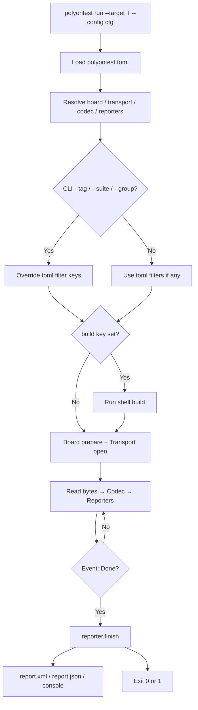

# CLI reference

Binary crate: `polyontest` (command: `polyontest`).

## Run pipeline



## Commands

```bash
polyontest plugins
polyontest run --target <name> --config path/to/polyontest.toml \
  [--tag TAG] [--suite SUITE] [--group GROUP]
```

| Flag | Meaning |
|------|---------|
| `--target` | Key under `[target.<name>]` in the toml (default `host`) |
| `--config` | Path to `polyontest.toml` |
| `--tag` | Host only — sets `POLYONTEST_TAG` for the DUT |
| `--suite` | Host only — sets `POLYONTEST_SUITE` |
| `--group` | Host only — sets `POLYONTEST_GROUP` (requires `--suite`) |

CLI filter flags **override** matching keys in the toml.

## Toml schema (`[target.*]`)

| Key | Default | Notes |
|-----|---------|-------|
| `board` | `host` | `host`, `qemu_m33` |
| `transport` | `stdio` | `stdio` (host), `uart` (qemu) |
| `codec` | `cobs` | `cobs`, `text` |
| `mode` | `stream` | only `stream` in v0.1 |
| `reporters` | `console`, `junit` | also `json` |
| `binary` | `./test_bin` | host binary or QEMU ELF |
| `build` | — | shell command run before spawn |
| `timeout_ms` | `30000` | stream deadline |
| `tag` / `suite` / `group` | — | host filters (same as CLI) |

Example:

```toml
[target.host]
board = "host"
transport = "stdio"
codec = "cobs"
mode = "stream"
reporters = ["console", "junit", "json"]
binary = "build/host_c/host_c_tests"
tag = "smoke"
timeout_ms = 10000
```

!!! note "Board / transport pairing"
    `host` requires `transport = "stdio"`. `qemu_m33` requires
    `transport = "uart"` (semihosting → QEMU stderr). See
    [Architecture](architecture.md).

## Host vs QEMU filters

| Board | Execution filter |
|-------|------------------|
| `host` | Env vars → DUT `polyontest_run_from_env()` |
| `qemu_m33` | **Not supported** — freestanding has no `getenv`. CLI errors if filters are set. Hard-code `polyontest_run_tag` / `run_suite` in the QEMU `main` if needed. |

DUT binaries should call `polyontest_run_from_env()` (or the C++/Rust wrappers) so filters take effect.

See also [Tags](tags.md).
