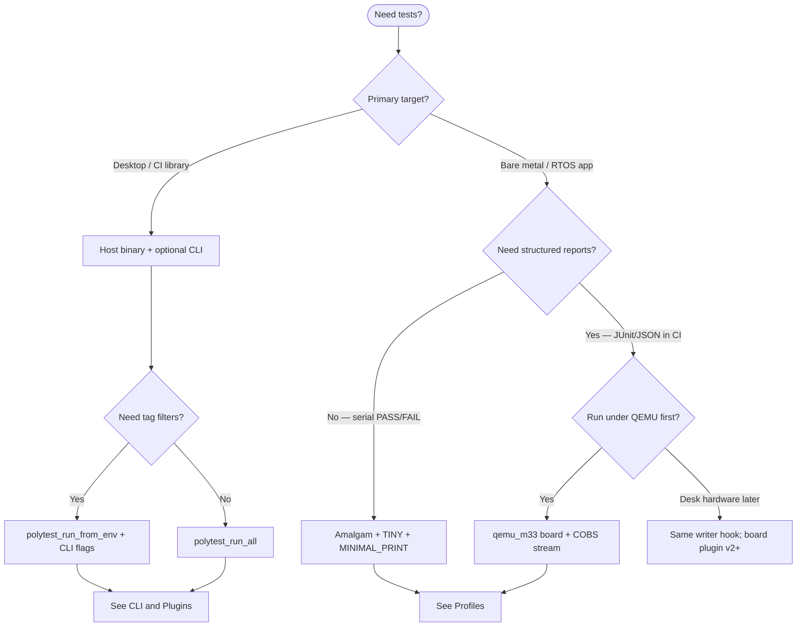
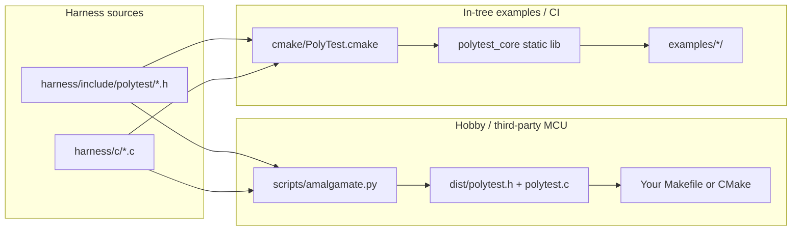
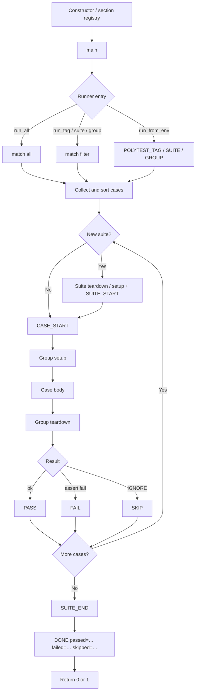
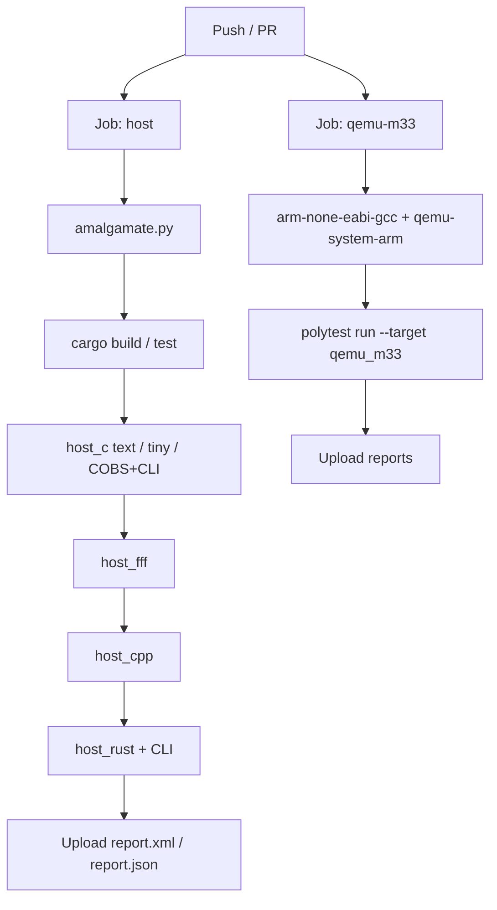

# Concepts

How PolyTest fits together: progressive enhancement, when to choose each path,
how the amalgam is built, and how CI exercises the matrix.

## Progressive enhancement

| Workflow | Name | Audience | Status |
|----------|------|----------|--------|
| Auto-register | Linker/ctor test discovery | Everyone | **v0.1** |
| Core stream | Boot → run → stream results | Hobby / MCU / host | **v0.1** |
| Size profiles | tiny / small / full | MCU flash budgets | **v0.1** |
| FFF mocks | Header-only fakes | Host unit tests | **v0.1** |
| Command | Boot → listen → host RPC | HIL / RTOS | v2 |
| HIL conductor | Main DUT + aux stimulator | Multi-board HIL | v2.x |

v0.1 is **stream mode only**: the DUT runs tests and emits events; the host
CLI drains that stream into reporters. Command mode and multi-board HIL are
planned extensions that reuse the same plugin traits.

## Which path should I use?

| Path | Docs |
|------|------|
| Amalgam drop-in | [Quickstart](quickstart.md) · [Profiles](profiles.md) |
| Host + CLI | [CLI](cli.md) · [Architecture](architecture.md) |
| QEMU on-target | [Quickstart](quickstart.md) (QEMU tab) · [example README](https://github.com/malto101/Open-PolyTest-Framework/blob/main/examples/qemu_m33_smoke/README.md) |
| Language adapters | [C++](cpp.md) · [Rust](rust.md) |

## Amalgamate vs modular CMake

Two ways to consume the C harness:

- **Amalgam** — copy two files; no PolyTest build system on the DUT.
- **Modular** — link `polytest_core` via `PolyTest.cmake` when developing inside
  this repo or mirroring the example layout.

!!! tip "Generated files"
    `dist/*` is produced by amalgamate and marked do-not-edit. Change
    `harness/` sources, then re-run `python3 scripts/amalgamate.py`.

## Test lifecycle

Registration happens before `main`. The runner walks suites and cases, emits
events, then returns a process exit code.

## CI matrix

Upstream CI (`.github/workflows/ci.yml`) mirrors the two main integration
paths:

Locally, the same commands appear in [Quickstart](quickstart.md).

## Next

- [Architecture](architecture.md) — host vs target, PTWP, plugin dependency rule
- [Roadmap](roadmap.md) — future tiers: isolation, HIL, coverage, chaos
- [Profiles](profiles.md) — flash budget knobs
- [Plugins](plugins.md) — extending the CLI composition root