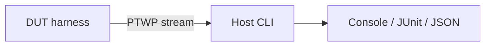

# PolyOnTest

Embedded-first unit and on-target tests for **C**, **C++**, and **Rust** — from a
two-file MCU drop-in to host CI — without a vendor RTOS or build-system lock-in.



<div class="grid cards" markdown>

-   :material-rocket-launch: **Quickstart**

    ---

    Amalgam drop-in, host CLI, and QEMU Cortex-M33 in minutes.

    [:octicons-arrow-right-24: Get started](quickstart.md)

-   :material-sitemap: **Concepts**

    ---

    Progressive enhancement, path selection, lifecycle, and CI matrix.

    [:octicons-arrow-right-24: Overview](concepts.md)

-   :material-graph: **Architecture**

    ---

    SOLID plugins, PTWP wire model, host vs on-target diagrams.

    [:octicons-arrow-right-24: Architecture](architecture.md)

-   :material-map-legend: **Roadmap**

    ---

    Tiered capability map: isolation, HIL, coverage, chaos — design only.

    [:octicons-arrow-right-24: Roadmap](roadmap.md)

-   :material-chip: **Profiles**

    ---

    tiny / small / full flash budgets and orthogonal knobs.

    [:octicons-arrow-right-24: Size profiles](profiles.md)

-   :material-console: **CLI**

    ---

    `polyontest run`, filters, and `polyontest.toml` schema.

    [:octicons-arrow-right-24: CLI reference](cli.md)

-   :material-puzzle: **Plugins & mocks**

    ---

    Transport/codec/board/reporter traits and FFF fakes.

    [:octicons-arrow-right-24: Plugins](plugins.md) · [Mocking](mocking.md)

</div>

## Progressive enhancement

| Workflow | Status |
|----------|--------|
| Auto-register + Core stream | **v0.1** |
| Size profiles + FFF mocks | **v0.1** |
| Isolation / command / HIL / coverage | [Roadmap](roadmap.md) (v1.x–v3) |

Language adapters: [C++](cpp.md) · [Rust](rust.md). Tag filtering: [Tags](tags.md).

## Build this site

```bash
python3 -m venv .venv-docs
source .venv-docs/bin/activate
pip install -r docs/requirements.txt
mkdocs serve
```
