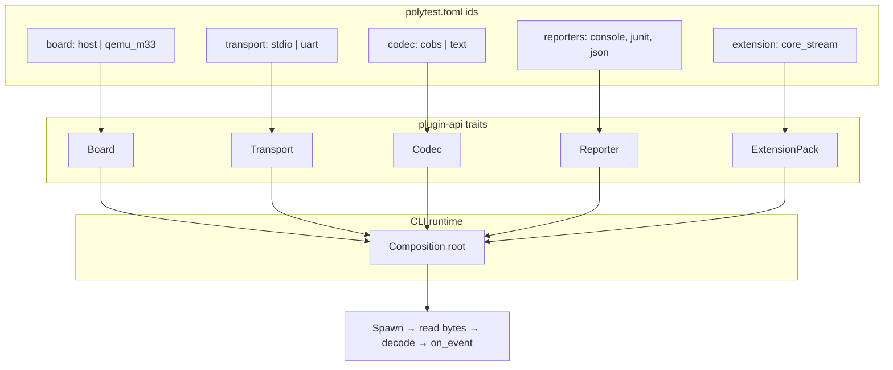

# Writing plugins

PolyTest’s host CLI is a composition root over traits in
[`crates/polytest-plugin-api`](https://github.com/malto101/Open-PolyTest-Framework/tree/main/crates/polytest-plugin-api).
Builtins live in
[`crates/polytest-builtins`](https://github.com/malto101/Open-PolyTest-Framework/tree/main/crates/polytest-builtins).

## Plugin stack



## Plugin kinds

| Trait | Responsibility | Builtin examples |
|-------|----------------|------------------|
| `Transport` | Byte pipe open/read/write/close | `stdio`, `uart` |
| `Codec` | Frame encode / decode feed | `cobs`, `text` |
| `Board` | Prepare / flash / reset / artifact path | `host`, `qemu_m33` |
| `Reporter` | Consume `Event`s → console/JUnit/JSON | `console`, `junit`, `json` |
| `ExtensionPack` | Optional capability bundle | `core_stream` |

Follow Interface Segregation: implement only the trait you need. Core never
imports a concrete UART or board.

## Adding a builtin

1. Implement the trait in `polytest-builtins` (new module or extend an existing one).
2. Register it in the CLI / discovery path used by `polytest.toml` `id` fields.
3. Document the `id` string and any config keys.

Sketch:

```rust
use polytest_plugin_api::{Board, PluginError, Result};

pub struct MyBoard { /* … */ }

impl Board for MyBoard {
    fn id(&self) -> &'static str { "my_board" }
    fn prepare(&mut self) -> Result<()> { Ok(()) }
    fn artifact(&self) -> Option<std::path::PathBuf> { None }
}
```

## On-target “plugins”

The C harness does not dlopen. Board glue is compile-time:

- `polytest_set_writer` for the byte sink
- Optional `polytest_set_locks` (full profile)
- Linker section / ctors for case discovery

See [Architecture](architecture.md) and [Profiles](profiles.md).

## Extension packs (C)

Header-only extensions (e.g. FFF fakes) live under `plugins/extension/` and are
included by test code — they are not Rust trait plugins. See [Mocking](mocking.md).

!!! info "Roadmap ids"
    Documented for later versions: `usb_cdc`, `hci`, `nanopb`, `pico2w`,
    `command`, `hil_conductor`, plus isolation / coverage / chaos packs.
    See [Roadmap](roadmap.md). v0.1 ships stream mode only.
