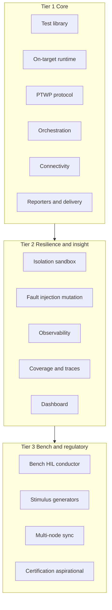
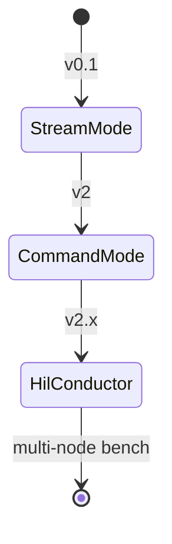
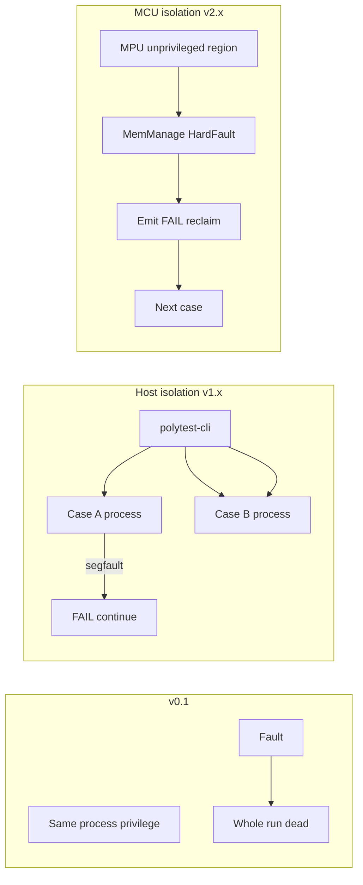
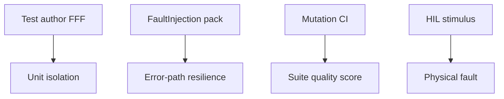
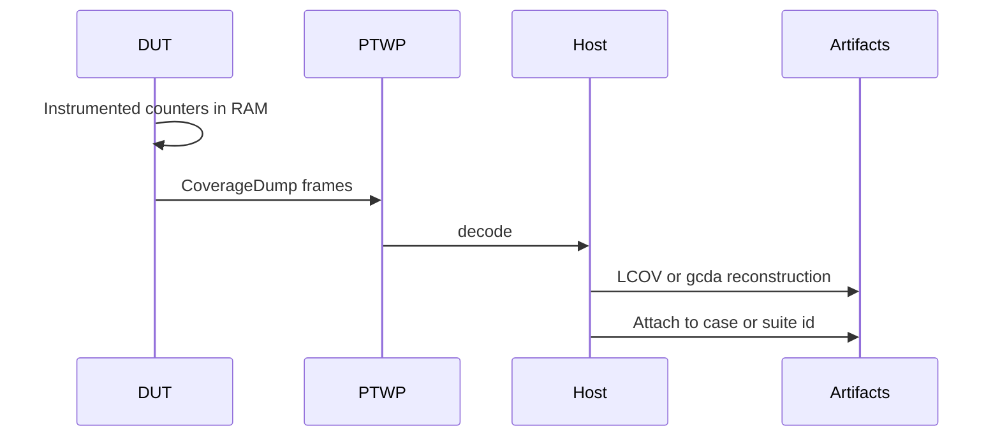
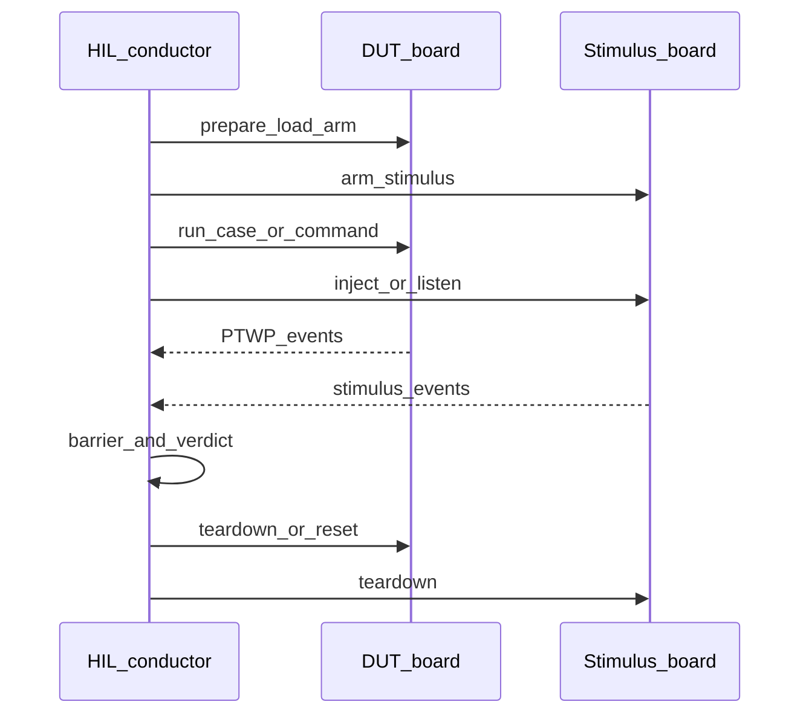
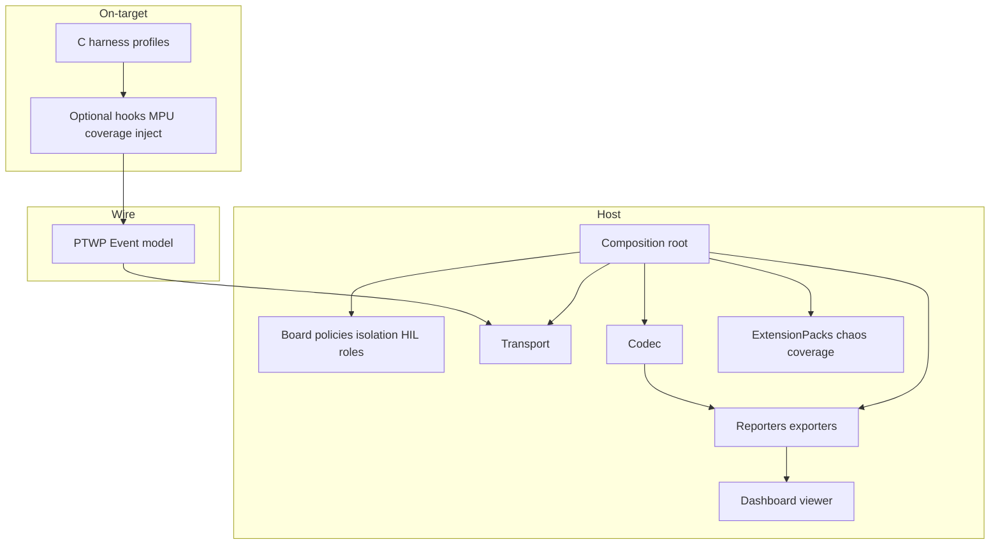
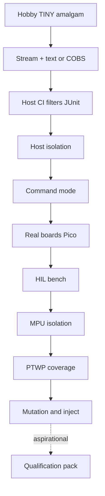

# Roadmap

Design and architecture for PolyTest beyond v0.1. This page is the **product
capability map** and the intended shape of future work — not an implementation
spec. Near-term shipping priority is **isolation** and **HIL**; certification
stays aspirational.

!!! note "Design rule"
    Future capabilities ship as **host plugins**, **ExtensionPacks**, or
    **profile-gated harness hooks**. The amalgam core stays freestanding and
    flash-budget honest — nothing here forces cost into `POLYTEST_PROFILE_TINY`.

Related today: [Architecture](architecture.md) · [Concepts](concepts.md) ·
[Plugins](plugins.md).

---

## Capability taxonomy

| Tier | Pillars |
|------|---------|
| **1 — Core** | Test library · On-target runtime + profiles · PTWP · Orchestration · Connectivity · Reporting exporters + delivery |
| **2 — Resilience & insight** | Isolation / sandboxing · Fault injection + mutation · Observability · Coverage / trace harvest · Dashboard |
| **3 — Bench & regulatory** | Bench HIL (stimulus + sync) · Certification / TQK (**aspirational only**) |

---

## Ship waves

| Wave | Focus | Closes |
|------|-------|--------|
| **v0.1** (now) | Library, runtime, PTWP, stream orchestration, console/JUnit/JSON, FFF, host + QEMU M33, CI | Tier 1 spine |
| **v1.x** | Host process-per-case isolation; PTWP timing / heap watermarks; post-run dashboard over JSON; host coverage | Tier 2 MVP (host-first) |
| **v2** | Command mode; real UART / USB CDC / HCI; Pico boards | Orchestration depth + connectivity |
| **v2.x** | HIL conductor (stimulus + barriers); MCU MPU isolation; freestanding PTWP coverage dump | Priority: **isolation + HIL** |
| **v3** | Mutation CI; richer live fault injection | Chaos depth |
| **Later** | Tool qualification kit / certified-compiler matrix | Aspirational — not staffed until HIL + isolation ship |

**Locked sequence:** host isolation → command + HIL bench → MCU MPU isolation →
coverage depth → mutation / chaos. Certification remains a Tier-3 footnote.

---

## Tier 1 — Core (v0.1 spine)

What ships today and how it grows without breaking the plugin dependency rule
([Architecture](architecture.md)).

### Test library

Unity-like `TEST` / tags / params, asserts, suite/group fixtures, FFF mocks,
thin C++ / Rust adapters.

**Forward design**

- Per-case fixtures (beyond suite/group) as optional macros on SMALL/FULL.
- Rust `#[polytest::test]` proc-macro as a first-class adapter, not only FFI.
- Mocking stays an ExtensionPack path (`fff_fakes` today); codegen mocks later.

### On-target runtime and profiles

Auto-registration, filtered runner, TINY / SMALL / FULL, writer and lock hooks.

**Forward design**

- Profile gates remain the only way heavy Tier-2/3 hooks appear on-target.
- Isolation and coverage hooks never enable under TINY.

### Protocol (PTWP)

Codec-agnostic `Event` model; COBS binary or text lines.

**Forward design**

- Extend the enum for timing, resource watermarks, coverage frames, and
  command-mode RPC — without breaking stream-mode consumers that ignore unknown
  types where possible.
- Command mode reuses the same event vocabulary for acknowledgements and
  case-level control.

### Orchestration

v0.1 is **stream mode only**: DUT runs; host drains until `Done`.

| Mode | Control plane | DUT role |
|------|---------------|----------|
| **Stream** | Host drains | Boot → run all/filtered → emit → exit |
| **Command** | Host RPC | Boot → listen → run case / inject / reset on demand |
| **HIL conductor** | Host clocks multi-board steps | DUT + stimulus peers under barriers |

### Connectivity

Plugin traits `Board` + `Transport`. Builtins: `host`, `qemu_m33` (logical
`uart` = semihosting).

**Forward plugin ids** (from [Plugins](plugins.md)): `usb_cdc`, `hci`, `nanopb`,
`pico2w`, plus real UART and desk-hardware flash/reset boards.

### Reporting and delivery

Console, JUnit, JSON exporters; GitHub CI; amalgam + modular CMake.

**Forward design**

- Exporters stay reporters; the **dashboard** is a separate viewer (Tier 2).
- Dynamic / third-party plugin discovery remains an open delivery improvement;
  traits already allow it without core changes.

---

## Tier 2 — Resilience and insight

### Isolation and sandboxing

**Problem.** A HardFault, OOM, kernel panic, or host segfault ends the entire
run. Fixtures reset *state*; isolation contains *blast radius*.

| Target | Mechanism | Owner |
|--------|-----------|-------|
| Host / CI | Process-per-case (fork or re-spawn); crash → FAIL + continue | `host` board + CLI policy |
| QEMU | Optional reboot-between-case / between-suite | `qemu_*` board policy |
| MCU / RTOS | MPU regions, unprivileged test task; fault → FAIL → reclaim or reset | Profile-gated ExtensionPack (≥ SMALL/FULL) |
| Linux DUT | Namespaces / seccomp | Optional later; out of MCU path |

**Architecture notes**

- Isolation is a **Board / runner policy**, not a reporter concern.
- Stream mode can still isolate on host by spawning one filtered binary (or one
  case via env) per child; command mode makes per-case reset natural.
- MPU packs must not link into TINY builds.

### Fault injection and mutation (chaos)

FFF today is **author-written** fakes. Chaos is **systematic** resilience
testing.

| Mode | Intent | Architectural home |
|------|--------|--------------------|
| Software mutation | Flip conditionals / drop lines; measure kill rate of the suite | Offline host CI job; not on-silicon first |
| System fault injection | `alloc` → NULL, I2C timeout, drop packets | ExtensionPack + interceptor hooks; live inject via command mode |
| Hardware fault injection | Brownout, clock glitch, power cycle | Tier-3 stimulus `Board` roles |

**Forward design**

- Keep mutation off the DUT flash path: mutate host or rebuild artifacts in CI.
- Fault-injection APIs should be selectable per case/suite (tags), so chaos
  runs are opt-in.
- Hardware faults share the HIL conductor sync model below.

### Observability

v0.1 observability is the PTWP pass/fail stream plus console.

**MVP (v1.x)**

- Per-case wall time and optional heap / stack high-water marks as PTWP fields
  or sibling events.
- Host live tail already exists via console reporter; enrich, do not replace.

**Later**

- Sampled PC / call traces on FULL or host-only.
- Coverage frames (next section) feed the same observability pipeline;
  reporters and the dashboard *consume* them.

### Coverage and execution-trace harvest

A freestanding MCU has no filesystem for `.gcda`. Coverage must ride the wire.

| Capability | Design |
|------------|--------|
| Freestanding coverage | New PTWP message types; host reconstructs LCOV / `.gcda` |
| Per-case resources | Timing + heap/stack watermarks on case events |
| Host-first path | Native gcov/LLVM-cov on `host` board before silicon dump |
| Hot-spots | Optional; FULL profile or host-only |

Coverage sits under **observability**; JUnit/JSON/dashboard only *display*
harvested data.

### Reporting dashboard

Exporters ≠ dashboard.

| Piece | Role | Wave |
|-------|------|------|
| Console / JUnit / JSON | Machine- and human-readable **exporters** | v0.1 |
| Post-run dashboard | Viewer over JSON/history: suite matrix, flakes, boards | v1.x first |
| Live event UI | Optional SPA over streaming PTWP | After post-run viewer |

**Decision:** ship a **post-run viewer** first (consume existing artifacts and a
small history store). Do not block v1.x on a live dashboard.

---

## Tier 3 — Bench HIL and regulatory

### Environmental simulators and HIL orchestration

v2 sketches a dual-board conductor. The full design is a **test bench**: one
composition root clocks multiple board *roles*.

| Role | Examples | Plugin shape |
|------|----------|--------------|
| DUT | Application MCU, QEMU | Existing `Board` |
| Stimulus | Programmable PSU, secondary MCU, RF peer, LA trigger | `Board` or ExtensionPack with sync API |
| Synchronizer | Host barriers: TX on board A ↔ RX on board B | Conductor in CLI |

**Topology config (design sketch)**

- `polytest.toml` (or a bench file) lists nodes: `{ id, board, role, transport }`.
- Conductor steps: `arm` → `barrier` → `run` → `collect` → `verdict`.
- Command mode on the DUT pairs naturally with stimulus peers; stream mode can
  still participate for simple “DUT emits while aux listens” benches.

**Priority:** this wave is a **first-class ship goal** after host isolation and
command/connectivity foundations — ahead of certification work.

### Certification and regulatory packs (aspirational)

!!! warning "Not near-term work"
    Tool qualification (ISO 26262 / DO-178 / IEC 62304 style), certified-compiler
    matrices (IAR, Arm Compiler 6, Tasking), and MISRA consumption packs are
    **aspirational Tier-3 notes only**. Do not staff a Tool Qualification Kit
    until **HIL and isolation have shipped**. Revisit only if a safety market
    pull appears.

Possible future artifacts (documentation-level reminder, not a backlog
commitment): TQK evidence, frozen amalgam hashes, requirements↔test↔coverage
traceability, MISRA guidance for amalgam consumers.

---

## Cross-cutting architecture

### Where each capability plugs in

| Concern | Primary extension point |
|---------|-------------------------|
| Isolation (host) | `Board` spawn policy + CLI |
| Isolation (MCU) | Profile-gated harness + ExtensionPack |
| Fault injection | ExtensionPack (+ command RPC later) |
| Mutation | Host CI tooling outside DUT amalgam |
| Coverage dump | PTWP + harness hooks + coverage reporter |
| Dashboard | Consumes reporter artifacts / history |
| HIL / stimulus | Multi-`Board` conductor in CLI |
| Certification | Docs / pack only if ever revived |

### Progressive enhancement vs enterprise depth

Hobby and CI users stay on the left. Enterprise depth accumulates to the right
without rewriting the Tier 1 spine.

---

## Decisions locked

| Topic | Decision |
|-------|----------|
| Dashboard | Post-run viewer first; live UI later |
| Observability MVP | PTWP timing + resource watermarks before freestanding coverage |
| Isolation MVP | Host process-per-case before MPU |
| HIL | Full bench roles (DUT + stimulus + sync), not only dual-board shorthand |
| Certification | Aspirational Tier-3 note; **HIL and isolation ship first** |
| Flash budget | No Tier-2/3 on-target cost in TINY |

---

## Out of scope for this document

- Concrete crate layouts, API signatures, or ticket-level tasks.
- Implementation of any wave above.

When a wave starts, turn the relevant section into an ADR or design doc under
`docs/` and keep this roadmap as the index of intent.
